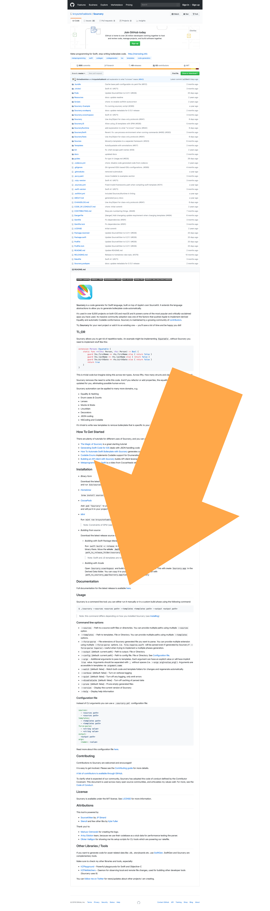

slidenumbers: true
slidecount: true
footer: @uberbruns

[.slidenumbers: false]
[.hide-footer]

---

[.slidenumbers: false]
[.hide-footer]


---

# **Sourcery by Example**
## *Karsten Bruns*

---

## So, Sourcery…

---

## Some Facts

- Repo: [github.com/krzysztofzablocki/Sourcery](https://github.com/krzysztofzablocki/Sourcery)
- Commonly installed via *brew* or *CocoaPods*
- Executed from the command line via `sourcery`

---

## What Does It Do?

1. It reads your Swift sources
2. Generates an Abstract Syntax Tree (AST) using SourceKit
3. Puts the AST into a Templating Engine
4. Supplies templates you write with the AST to generate new Swift Code

---
[.build-lists: true]

## Template Languages

- Stencil[^1] + StencilSwiftKit[^2]
- JavaScript
- Swift 😱

[^1]: Stencil: [http://stencil.fuller.li/en/latest](http://stencil.fuller.li/en/latest/)

[^2]: StencilSwiftKit: [https://github.com/SwiftGen/StencilSwiftKit](https://github.com/SwiftGen/StencilSwiftKit)


---

## Template Languages

- **Stencil[^1] + StencilSwiftKit[^2]**
- JavaScript
- Swift 😱

[^1]: Stencil: [http://stencil.fuller.li/en/latest](http://stencil.fuller.li/en/latest/)

[^2]: StencilSwiftKit: [https://github.com/SwiftGen/StencilSwiftKit](https://github.com/SwiftGen/StencilSwiftKit)


---

## Configuration

- command line arguments
- YAML file: `.sourcery.yml`


```yaml
sources:
  - ./Sources
templates:
  - ./Templates
output:
  ./Output
```

---

# Demo

---

## VIP-Architecture

- __V__iew/ViewController (User Interface)
- __I__nteractor (Business Logic)
- __P__resenter (Data Model to View Model Transformation)

---

[.slidenumbers: false]
[.hide-footer]

```swift
                        ┏━━━━━━━━━━━━━━━━┓                       
              received  ┃                ┃                       
         ┌─────────────▶┃   Interactor   ┃────────────┐          
    *────┴────*         ┃                ┃      *─────┴────*     
    │ Request │         ┗━━━━━━━━━━━━━━━━┛      │ Response │     
    *────┬────*                                 *─────┬────*     
         │                                            │          
         │                                            │          
         │                                            ▼ presented
┏━━━━━━━━━━━━━━━━┓                             ┏━━━━━━━━━━━━━━━━┓
┃                ┃             *───────────*   ┃                ┃
┃ View/Interface ┃◀────────────┤ ViewModel ├───┃   Presenter    ┃
┃                ┃  displayed  *───────────*   ┃                ┃
┗━━━━━━━━━━━━━━━━┛                             ┗━━━━━━━━━━━━━━━━┛
```
## *A* **Scene's** *Unidirectional Data Cycle*

---

# Demo

---

## Take Aways ➊

**Code generation can…**

- minimize repetitive tasks
- augment language features (f.e. Enums)
- help implementing complex patterns
- go hand in hand with protocols to enforce correctness

---

## Take Aways ➋

**Generated code can…**

- live in a file in your `./Output` folder
- generate its own file name and path inside the template
- be inlined in code you have written

---

## More Cool Stuff to Check out ➊

- Automatically integrate generated files into your Xcode project
- Have custom macros in templates
- Annotations with arguments 

``` 
// sourcery:autogen: foo=0, bar=2
```

---

## More Cool Stuff to Check out ➋

- Trigger code generation automatically when you make edits using `--watch`
- Use JavaSript or Swift as Template Language
- ...

---

# If You Want to Try

- Check documentation and guides (Especially "Usage" and "Writing templates")
- Read the Stencil documentation and the one of the StencilSwiftKit extensions
- Have a look at the sample templates




---

# **Happy (Meta) Coding**
### **That's it!** 
